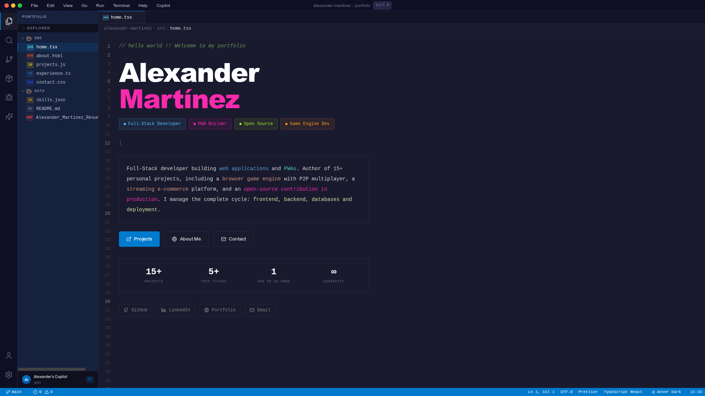

<div align="center">

# VS Code Portfolio — Alexander Martínez


**Un portafolio interactivo con apariencia de VS Code** — construido con Next.js, TypeScript y Tailwind CSS.

[Demo](https://anxer.is-a.dev) · [Reportar Bug](https://github.com/ZLostTK/Simple-Portfolio-React/issues) · [Solicitar Feature](https://github.com/ZLostTK/Simple-Portfolio-React/issues)



</div>

---

## ✨ Características

- **Shell de VS Code funcional** — Barra de título, Activity Bar, File Explorer, tabs, breadcrumbs, Status Bar
- **7 secciones tipo archivo** — Home, About, Projects, Skills, Experience, Contact, README
- **Paleta de comandos** — `Ctrl+P` / `Cmd+P` para navegar entre archivos
- **Terminal interactiva** — `Ctrl+ñ` / `Ctrl+\`` con comandos reales (`whoami`, `ls`, `cat`, `git log`, etc.)
- **Panel Copilot** — `Ctrl+Shift+C` / `Cmd+Shift+C` — chat simulado con IA sobre el portafolio
- **Efecto máquina de escribir** en el hero
- **Barras de progreso animadas** en skills
- **Modo oscuro** estilo VS Code "Anxer Dark"
- **Diseño responsivo** y accesible
- **Totalmente estático** — deployable a GitHub Pages, Netlify, o cualquier CDN

## 🚀 Stack

| Capa | Tecnología |
|------|-----------|
| Framework | Next.js 13.5 (App Router) |
| Lenguaje | TypeScript 5.2 |
| Estilos | Tailwind CSS 3.3 + `tailwindcss-animate` |
| Componentes | shadcn/ui (Radix UI) |
| Iconos | lucide-react |
| Paquetería | pnpm |

## 📁 Estructura

```
├── app/
│   ├── globals.css        # Estilos globales y variables CSS
│   ├── layout.tsx         # Root layout con metadata
│   └── page.tsx           # Entry point → EditorShell
├── src/
│   ├── features/
│   │   └── editor/        # EditorShell y componentes del VS Code simulado
│   ├── lib/               # Utilidades y helpers
│   └── shared/            # Componentes compartidos
├── components/
│   └── ui/                # Componentes shadcn/ui
├── hooks/                 # Custom hooks
├── lib/                   # Utilidades adicionales
├── public/                # Assets estáticos
└── .github/workflows/     # CI + Deploy a GitHub Pages
```

## 🛠️ Empezar

```bash
# Clonar
git clone https://github.com/ZLostTK/Simple-Portfolio-React.git
cd Simple-Portfolio-React

# Instalar dependencias
pnpm install

# Desarrollo
pnpm dev          # http://localhost:3000

# TypeScript check
pnpm typecheck

# Lint
pnpm lint

# Build producción
pnpm build
```

## 🌐 Deploy

### GitHub Pages (automático)

El workflow `deploy-gh-pages.yml` construye y despliega automáticamente a GitHub Pages en cada push a `master`. Solo necesitas:

1. Ir a **Settings > Pages** en tu repo
2. En "Source", seleccionar **GitHub Actions**
3. Listo — cada push despliega automáticamente

### Netlify

El `netlify.toml` ya está configurado. Conecta tu repo en Netlify y despliega.

## 📄 Licencia

MIT © [Alexander Martínez González](https://github.com/ZLostTK)

---

<div align="center">
  Hecho con ☕, 🎧 y mucho cariño por un dev mexicano 🇲🇽
</div>
